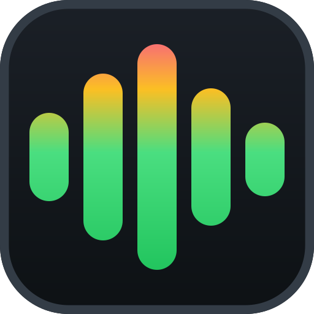
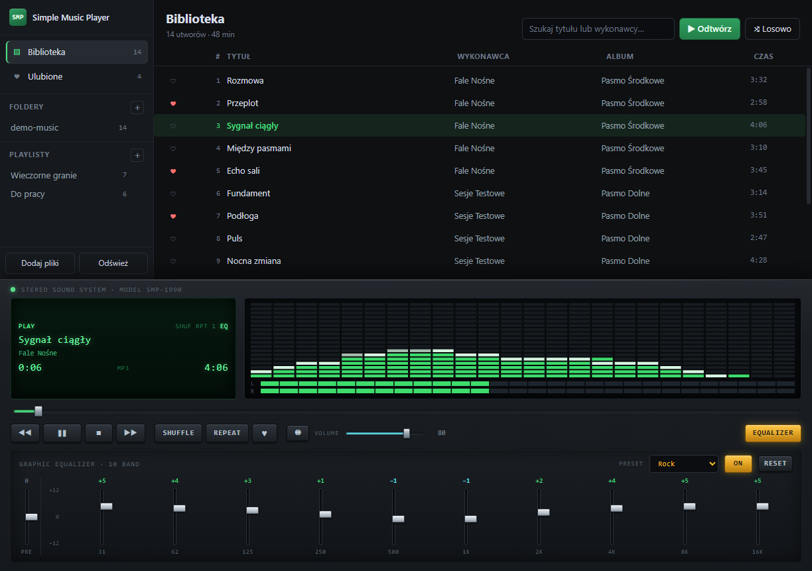
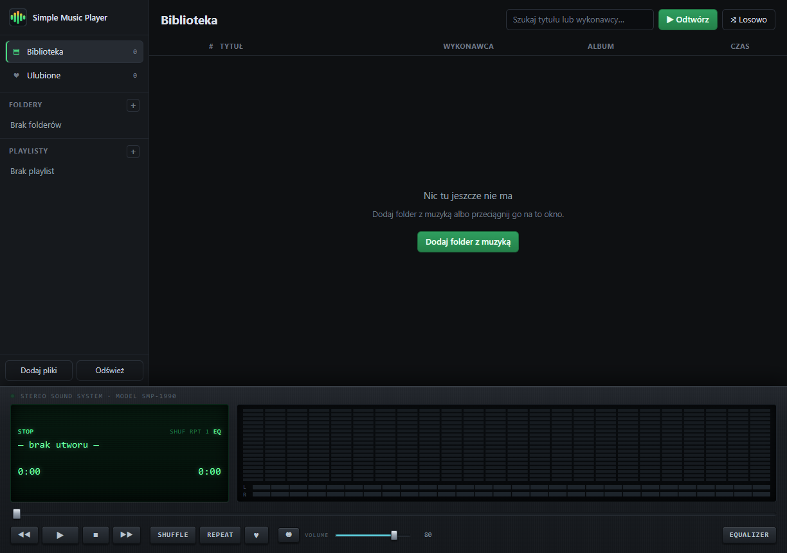
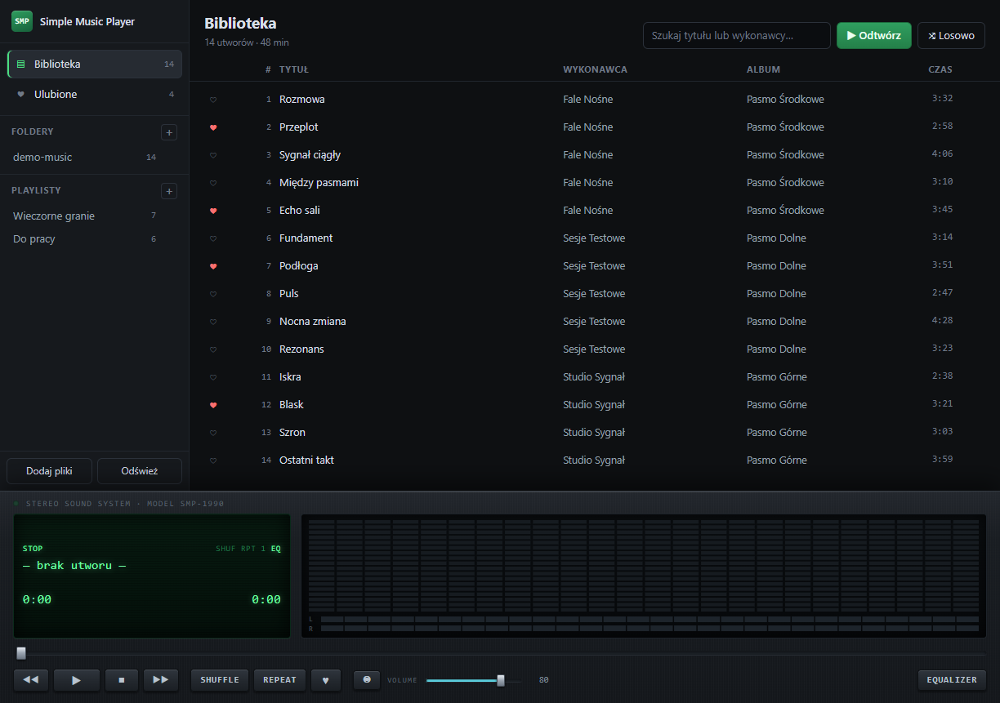
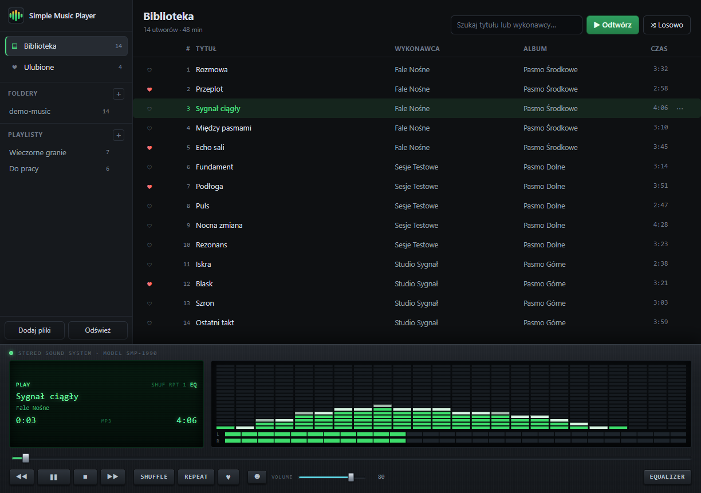
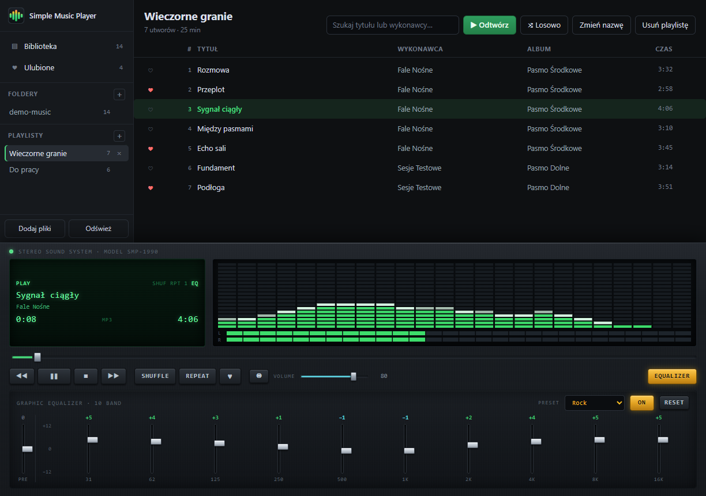
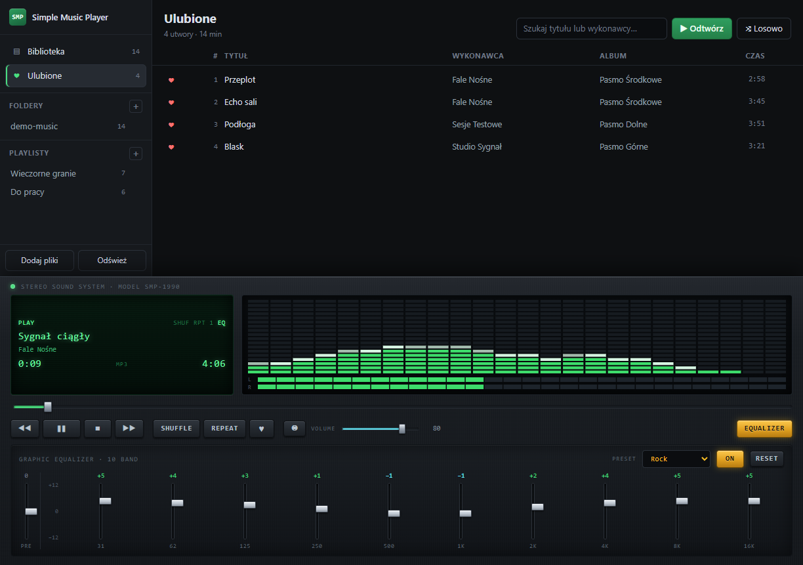

<p align="center">
  
</p>

# Simple Music Player

[](https://github.com/letyshub/simple-music-player/actions/workflows/tests.yml)
[](https://github.com/letyshub/simple-music-player/releases/latest)
[](LICENSE)

Odtwarzacz MP3 na Windows z playlistami, ulubionymi i dziesięciopasmowym
korektorem graficznym stylizowanym na wieżę hi-fi z lat 90.



## Co potrafi

- **Odtwarzanie folderu z muzyką** — wskaż folder, a program przeszuka go
  razem z podfolderami i wczyta tagi ID3. Możesz też przeciągnąć folder
  albo pojedyncze pliki prosto na okno.
- **Playlisty** — twórz je, zmieniaj nazwy, przeciągaj utwory z biblioteki
  na playlistę w panelu bocznym i zmieniaj kolejność przeciąganiem.
- **Ulubione** — kliknij serce przy utworze. Wszystkie ulubione zbierają się
  w osobnym widoku.
- **Korektor** — dziesięć suwaków od 31 Hz do 16 kHz, wzmocnienie wstępne,
  dziesięć presetów i przełącznik obejścia. Do tego analizator widma
  z opadającymi znacznikami szczytu oraz wskaźniki wysterowania dla obu kanałów.
- **Eksport na urządzenie** — skopiuj playlistę, ulubione albo zaznaczone
  utwory na pendrive, kartę SD czy odtwarzacz MP3. Pliki dostają numery
  zachowujące kolejność listy, a ponowny eksport dokopiowuje tylko to,
  czego tam jeszcze nie ma.
- Obsługiwane formaty: MP3, M4A, AAC, FLAC, OGG, Opus, WAV, WMA.

Biblioteka, playlisty, ulubione i ustawienia korektora zapisują się
automatycznie i wracają po ponownym uruchomieniu.

## Zrzuty ekranu

| | |
|---|---|
|  |  |
| Pierwsze uruchomienie | Biblioteka |
|  |  |
| Odtwarzanie z analizatorem widma | Playlista |
|  |  |
| Korektor graficzny | Ulubione |

Na zrzutach widać wygenerowane pliki demonstracyjne, nie prawdziwe nagrania.

## Pobieranie

Gotowe pliki są na [stronie wydań](https://github.com/letyshub/simple-music-player/releases/latest):

- **instalator** — zwykła instalacja ze skrótem w menu Start,
- **wersja przenośna** — jeden plik, działa bez instalacji, choćby z pendrive'a.

Pliki nie są podpisane cyfrowo, więc przy pierwszym uruchomieniu Windows
SmartScreen pokaże ostrzeżenie „Nie chroniono komputera". To normalne dla
programów bez płatnego certyfikatu. Kliknij **Więcej informacji**, a potem
**Uruchom mimo to**. Jeśli wolisz nie ufać cudzemu plikowi wykonywalnemu,
zbuduj aplikację ze źródeł — instrukcja niżej.

## Uruchomienie ze źródeł

Potrzebujesz Node.js 20 lub nowszego.

```bash
npm install
npm start
```

## Budowanie wersji dla Windows

```bash
npm run dist
```

Powstaną dwa pliki w katalogu `dist/`: instalator NSIS oraz wersja
przenośna, która działa bez instalacji.

Sam katalog aplikacji, bez pakowania do instalatora:

```bash
npm run pack
```

Ikona aplikacji powstaje z pliku `src/renderer/assets/logo.svg` i odświeża się
sama przy każdym budowaniu. Osobno:

```bash
npm run icon
```

## Wydawanie nowej wersji

Wydania robi pipeline, nie człowiek z własnego komputera.

Najpierw opisz zmiany w [CHANGELOG.md](CHANGELOG.md) pod nagłówkiem nowej
wersji — ta treść stanie się opisem wydania na GitHubie, więc pisz ją dla
kogoś, kto zastanawia się, czy warto pobrać aktualizację. Dopiero potem
podnieś wersję i wypchnij tag:

```bash
npm version 1.2.0
git push origin main --follow-tags
```

Kolejność ma znaczenie i `npm version` sam jej pilnuje: jeśli w dzienniku nie
ma sekcji dla nowego numeru, odmówi i nie założy ani commita, ani tagu.
Zostanie tylko podbity `package.json`, który cofniesz przez
`git checkout package.json package-lock.json`. Gdyby ta kontrola działała
dopiero w pipelinie, tag wskazywałby już commit bez opisu i trzeba by go
kasować ze zdalnego repozytorium.

Tag zaczynający się od `v` uruchamia budowanie na Windows: testy jednostkowe,
instalator i wersja przenośna, a na końcu **szkic** wydania z podpiętymi
plikami, a opisem wydania staje się sekcja z dziennika zmian. Szkic, a nie od
razu opublikowane wydanie — pobierz pliki, sprawdź, czy program się uruchamia,
i dopiero wtedy kliknij „Publish release".

Pipeline powtarza obie kontrole u siebie, bo tag może powstać także z ręki:
przerwie pracę, gdy nie zgadza się z wersją w `package.json` albo gdy dla
wydawanej wersji nie ma opisu w dzienniku. Pierwsze chroni przed wydaniem
`v1.2.0` z plikami nazwanymi `1.1.0`, drugie przed instalatorem, którego
strona wydania nie mówi ani słowa o zmianach.

## Skróty klawiszowe

| Skrót | Działanie |
|-------|-----------|
| Spacja | Odtwarzanie / pauza |
| Ctrl + → | Następny utwór |
| Ctrl + ← | Poprzedni utwór (lub od początku, jeśli minęły 3 sekundy) |
| Ctrl + F | Przejdź do wyszukiwania |
| Ctrl + E | Pokaż lub ukryj korektor |
| Delete | Usuń zaznaczone utwory z playlisty |
| F12 | Narzędzia deweloperskie |

Podwójne kliknięcie suwaka korektora zeruje dane pasmo.

## Testy

Logika biblioteki, kolejki odtwarzania i korektora ma testy jednostkowe:

```bash
npm test
```

Osobno działa test dymny, który uruchamia prawdziwą aplikację, importuje
folder z plikami, odtwarza utwór i sprawdza rzeczy nieosiągalne dla testów
jednostkowych — między innymi to, czy analizator widma faktycznie dostaje
próbki dźwięku:

```bash
npm run test:smoke -- "C:\sciezka\do\folderu\z\mp3" "C:\gdzie\zapisac\zrzuty"
```

Zrzuty ekranu do tego pliku powstają skryptem, więc po zmianie wyglądu można
je odświeżyć jedną komendą zamiast robić je ręcznie:

```bash
node tools/screenshots.mjs "C:\sciezka\do\folderu\z\mp3"
```

## Jak to jest zbudowane

Aplikacja to Electron. Proces główny zajmuje się dyskiem, okno zajmuje się
dźwiękiem i obrazem.

```
src/
  main/       proces główny: okno, skanowanie folderów, zapis biblioteki,
              strumieniowanie plików audio do okna
  renderer/   interfejs: graf Web Audio, korektor, analizator, widoki
  shared/     logika bez zależności od Electrona, pokryta testami
tests/        testy jednostkowe i dymne
tools/        skrypty pomocnicze: zrzuty ekranu i ikona aplikacji
build/        wygenerowana ikona dla instalatora
```

Okno nie ma dostępu do systemu plików. Zarówno interfejs, jak i pliki audio
docierają do niego przez własny protokół `app://`, który obsługuje żądania
zakresowe, więc przewijanie działa bez wczytywania całego utworu. Wspólny
protokół to nie przypadek: dzięki niemu strona i dźwięk mają to samo
pochodzenie, a graf Web Audio nie traktuje utworu jako obcego zasobu, co
wyciszyłoby analizator widma.

Szczegóły projektowe: [docs/superpowers/specs/](docs/superpowers/specs/).

## Licencja

MIT. Zobacz [LICENSE](LICENSE).
