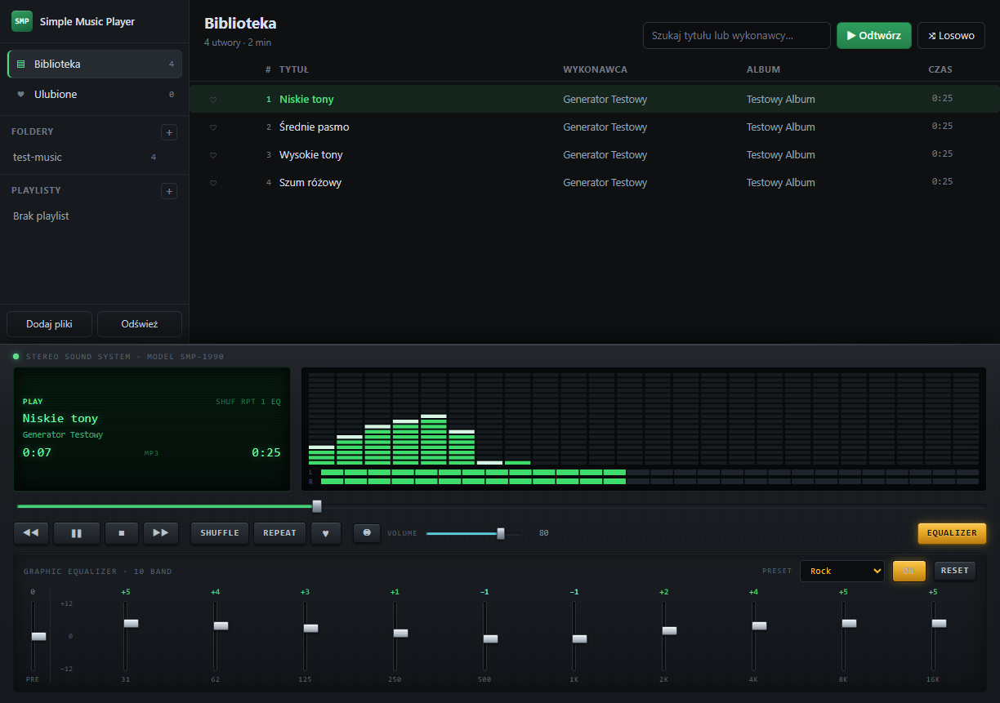

# Simple Music Player

Odtwarzacz MP3 na Windows z playlistami, ulubionymi i dziesięciopasmowym
korektorem graficznym stylizowanym na wieżę hi-fi z lat 90.



## Co potrafi

- **Odtwarzanie folderu z muzyką** — wskaż folder, a program przeszuka go
  razem z podfolderami i wczyta tagi ID3. Możesz też przeciągnąć folder
  albo pojedyncze pliki prosto na okno.
- **Playlisty** — twórz je, zmieniaj nazwy, przeciągaj utwory z biblioteki
  na playlistę w panelu bocznym i zmieniaj kolejność przeciąganiem.
- **Ulubione** — kliknij serce przy utworze. Wszystkie ulubione zbierają się
  w osobnym widoku.
- **Korektor** — dziesięć suwaków od 31 Hz do 16 kHz, wzmocnienie wstępne,
  dziesięć presetów i przełącznik obejścia. Do tego analizator widma
  z opadającymi znacznikami szczytu oraz wskaźniki wysterowania dla obu kanałów.
- Obsługiwane formaty: MP3, M4A, AAC, FLAC, OGG, Opus, WAV, WMA.

Biblioteka, playlisty, ulubione i ustawienia korektora zapisują się
automatycznie i wracają po ponownym uruchomieniu.

## Uruchomienie

Potrzebujesz Node.js 20 lub nowszego.

```bash
npm install
npm start
```

## Budowanie wersji dla Windows

```bash
npm run dist
```

Powstaną dwa pliki w katalogu `dist/`: instalator NSIS oraz wersja
przenośna, która działa bez instalacji.

Sam katalog aplikacji, bez pakowania do instalatora:

```bash
npm run pack
```

## Skróty klawiszowe

| Skrót | Działanie |
|-------|-----------|
| Spacja | Odtwarzanie / pauza |
| Ctrl + → | Następny utwór |
| Ctrl + ← | Poprzedni utwór (lub od początku, jeśli minęły 3 sekundy) |
| Ctrl + F | Przejdź do wyszukiwania |
| Ctrl + E | Pokaż lub ukryj korektor |
| Delete | Usuń zaznaczone utwory z playlisty |
| F12 | Narzędzia deweloperskie |

Podwójne kliknięcie suwaka korektora zeruje dane pasmo.

## Testy

Logika biblioteki, kolejki odtwarzania i korektora ma testy jednostkowe:

```bash
npm test
```

Osobno działa test dymny, który uruchamia prawdziwą aplikację, importuje
folder z plikami, odtwarza utwór i sprawdza rzeczy nieosiągalne dla testów
jednostkowych — między innymi to, czy analizator widma faktycznie dostaje
próbki dźwięku:

```bash
npm run test:smoke -- "C:\ścieżka\do\folderu\z\mp3" "C:\gdzie\zapisać\zrzuty"
```

## Jak to jest zbudowane

Aplikacja to Electron. Proces główny zajmuje się dyskiem, okno zajmuje się
dźwiękiem i obrazem.

```
src/
  main/       proces główny: okno, skanowanie folderów, zapis biblioteki,
              strumieniowanie plików audio do okna
  renderer/   interfejs: graf Web Audio, korektor, analizator, widoki
  shared/     logika bez zależności od Electrona, pokryta testami
```

Okno nie ma dostępu do systemu plików. Pliki audio docierają do niego
przez własny protokół `track://`, który obsługuje żądania zakresowe, więc
przewijanie działa bez wczytywania całego utworu.

Szczegóły projektowe: [docs/superpowers/specs/](docs/superpowers/specs/).
